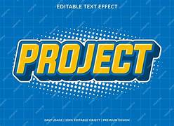

# text-to-sign-converter
its helps to convert text to sign for to mute person
## 🧠 Deep Code Analysis

### 1. Repository Classification
This project is classified as an **Application/Web App**. It leverages Python with the Django framework for the backend, indicated by the `requirements.txt` (listing Django) and the presence of a `templates` directory and `db.sqlite3`. The `A2SL` directory likely contains the core Django project/application code, and the included screenshot further confirms a web interface.

### 2. Technology Stack Detection

**Backend Technologies:**
*   **Runtime:** Python (detected from `.py` files, `requirements.txt`, `setup.py`).
*   **Framework:** Django (explicitly listed in `requirements.txt` and implied by `templates` and `db.sqlite3`).
*   **Libraries:**
    *   `nltk` (Natural Language Toolkit): For text processing and understanding.
    *   `Pillow`: Image processing library, likely used for handling or generating sign language images.
    *   `gTTS` (Google Text-to-Speech): For converting text into spoken audio.
    *   `numpy`: Fundamental package for scientific computing with Python, often used in conjunction with image processing.
    *   `opencv-python` (OpenCV): Open Source Computer Vision Library, reinforcing image/video processing capabilities, potentially for displaying sign language videos or gestures.
*   **Databases:** SQLite (detected by `db.sqlite3`).

**Frontend Technologies:**
*   **Frameworks:** No modern JavaScript frameworks (React, Vue, Angular) detected.
*   **Rendering:** Server-Side Rendered (SSR) HTML using Django's template engine (indicated by `templates` directory).
*   **Styling:** Standard CSS (no specific framework like Tailwind or SCSS detected).
*   **Scripting:** Basic JavaScript (implied by web app, but no specific libraries detected).

**DevOps & Tools:**
*   **Testing:** `test_nltk.py` suggests Python's built-in `unittest` or a testing framework like `pytest`.
*   **Containerization/CI/CD/Cloud:** None explicitly detected.

### 3. Project Structure Analysis

```
project-root/
├── .DS_Store
├── A2SL/                     # Primary Django project/application directory
├── LICENSE                   # Project license (MIT)
├── OIP.jpg                   # Image file, possibly a placeholder or logo
├── README.md                 # Project README
├── Screenshot 2026-02-04 210218.png # Application screenshot
├── assets/                   # Static assets (CSS, JS, images for frontend)
├── db.sqlite3                # SQLite database file
├── requirements.txt          # Python dependency list
├── setup.py                  # Python package setup script
├── templates/                # Django HTML templates
└── test_nltk.py              # Python test file for NLTK functionalities
```
*   **Entry points:** Assumed to be `manage.py` (standard Django entry point, expected at the project root or within `A2SL` but not explicitly listed in the provided structure) and Django's development server.
*   **Configuration files:** Django `settings.py` (expected within `A2SL`).
*   **Source code organization:** Python modules within `A2SL`, HTML templates in `templates/`.
*   **Asset locations:** `assets/` for static files, `OIP.jpg` for a main image.
*   **Test directories:** `test_nltk.py` for testing specific NLTK related logic.

### 4. Feature Extraction

*   **Core Functionalities:**
    *   **Text-to-Sign Language Conversion:** The primary function, converting user-inputted text into a sequence of sign language representations (likely images/GIFs/videos based on `Pillow` and `opencv-python`).
    *   **Natural Language Processing (NLP):** Utilizes `nltk` for processing and understanding input text, ensuring accurate conversion.
    *   **Dynamic Sign Display:** Renders the generated sign language output visually on a web interface.
    *   **Text-to-Speech Output:** Integrates `gTTS` to provide an audio representation of the input text, potentially aiding in accessibility or clarification.
*   **API Endpoints:** The project functions as a self-contained web application; no explicit public API endpoints are detected for external consumption.
*   **Configuration Options:** Primarily handled via Django's `settings.py` file.
*   **Environment Variables:** Not explicitly detected via `.env.example`, but common for Django projects (e.g., `SECRET_KEY`, `DEBUG`).

### 5. Installation & Setup Detection

*   **Package manager:** `pip` (Python package installer).
*   **Installation commands:** `pip install -r requirements.txt`.
*   **Development server setup:** `python manage.py runserver`.
*   **Environment requirements:** Python 3.x.
*   **Database setup needs:** Django migrations (`python manage.py migrate`) for `db.sqlite3`.
*   **External service dependencies:** None beyond the listed Python packages.

---

# 🚀 Text-to-Sign Converter

<div align="center">

 <!-- TODO: Add a more descriptive logo if OIP.jpg is not a logo -->

[](https://github.com/chandrama12-ac/text-to-sign-converter/stargazers)
[](https://github.com/chandrama12-ac/text-to-sign-converter/network)
[](https://github.com/chandrama12-ac/text-to-sign-converter/issues)
[](LICENSE)

**Effortlessly bridge communication gaps by converting text into American Sign Language visuals.**

</div>

## 📖 Overview

The Text-to-Sign Converter is a web application designed to facilitate communication for individuals who are deaf or hard of hearing by translating written text into a visual representation of sign language. Leveraging powerful Natural Language Processing (NLP) and computer vision techniques, this tool aims to provide an intuitive and accessible platform for converting textual information into expressive sign language visuals. It's built with a robust Python/Django backend capable of processing text and generating appropriate visual output.

## ✨ Features

-   🎯 **Text-to-Sign Language Conversion:** Accurately converts input text into a sequence of sign language images or animations.
-   🧠 **Natural Language Processing (NLP):** Utilizes NLTK for intelligent text parsing and understanding to ensure meaningful sign translations.
-   🖥️ **Dynamic Sign Display:** Renders clear and interactive sign language visuals directly within the web browser.
-   🗣️ **Text-to-Speech Output:** Provides an optional audio pronunciation of the input text using Google Text-to-Speech, enhancing accessibility.
-   ✍️ **User-Friendly Web Interface:** Simple and clean interface for easy text input and viewing of sign language output.

## 🖥️ Screenshots


## 🛠️ Tech Stack

**Backend:**
[](https://www.python.org/)
[](https://www.djangoproject.com/)
[](https://www.nltk.org/)
[](https://opencv.org/)
[](https://python-pillow.org/)
[](https://pypi.org/project/gTTS/)
[](https://numpy.org/)

**Database:**
[](https://www.sqlite.org/index.html)

**Frontend:**
[](https://developer.mozilla.org/en-US/docs/Web/HTML)
[](https://developer.mozilla.org/en-US/docs/Web/CSS)
[](https://developer.mozilla.org/en-US/docs/Web/JavaScript)

## 🚀 Quick Start

Follow these steps to get the Text-to-Sign Converter up and running on your local machine.

### Prerequisites
-   **Python 3.8+** (or compatible version as per `requirements.txt` dependencies)
-   **pip** (Python package installer)

### Installation

1.  **Clone the repository**
    ```bash
    git clone https://github.com/chandrama12-ac/text-to-sign-converter.git
    cd text-to-sign-converter
    ```

2.  **Install dependencies**
    It's recommended to use a virtual environment.
    ```bash
    # Create a virtual environment
    python -m venv venv
    # Activate the virtual environment
    # On Windows:
    # venv\Scripts\activate
    # On macOS/Linux:
    # source venv/bin/activate

    # Install Python dependencies
    pip install -r requirements.txt
    ```

3.  **Database setup**
    This project uses SQLite, and Django will create the database file and schema.
    ```bash
    # Apply database migrations
    # NOTE: Assumes 'manage.py' is in the root directory.
    # If 'manage.py' is nested (e.g., inside 'A2SL'), navigate there first.
    python manage.py migrate
    ```

4.  **Start development server**
    ```bash
    # Start the Django development server
    python manage.py runserver
    ```

5.  **Open your browser**
    Visit `http://localhost:8000` (or the port indicated in your console) to access the application.

## 📁 Project Structure

```
text-to-sign-converter/
├── A2SL/              # Main Django project settings and core app logic
│   ├── __init__.py
│   ├── settings.py    # Django project settings
│   ├── urls.py        # Project-level URL configurations
│   ├── wsgi.py
│   └── asgi.py
├── assets/            # Directory for static web assets (CSS, JS, images)
├── templates/         # Django template files (HTML)
├── db.sqlite3         # SQLite database file
├── LICENSE            # MIT License file
├── OIP.jpg            # Placeholder image or logo
├── README.md          # Project README file
├── requirements.txt   # List of Python dependencies
├── Screenshot 2026-02-04 210218.png # Application screenshot
├── setup.py           # Python package setup file
└── test_nltk.py       # Specific test file for NLTK functionalities
```
*Note: The `manage.py` file, which is crucial for Django projects, is assumed to be at the root of this repository, although it was not explicitly listed in the directory contents data provided.*

## ⚙️ Configuration

### Environment Variables
While no `.env.example` was detected, Django projects typically use environment variables for sensitive data or configuration specific to different environments. Key variables to consider might include:

| Variable      | Description                      | Default | Required |
|---------------|----------------------------------|---------|----------|
| `DEBUG`       | Django debug mode                | `True`  | No       |
| `SECRET_KEY`  | Django secret key for security   | (random)| Yes      |
| `DATABASE_URL`| Database connection string (e.g., for PostgreSQL) | (SQLite) | No |

These would typically be configured in your `A2SL/settings.py` or through environment variables in a production deployment.

### Configuration Files
-   `A2SL/settings.py`: The primary configuration file for the Django project, controlling database connections, installed apps, static file paths, and more.

## 🔧 Development

### Available Scripts
The core development commands are standard Django `manage.py` commands:

| Command                    | Description                                        |
|----------------------------|----------------------------------------------------|
| `python manage.py runserver` | Starts the Django development server.              |
| `python manage.py migrate`   | Applies database migrations.                       |
| `python manage.py makemigrations [app_name]` | Creates new database migrations based on model changes. |
| `python manage.py collectstatic` | Collects static files into `STATIC_ROOT` for deployment. |
| `python manage.py shell`   | Opens a Python shell with Django environment loaded. |

### Development Workflow
1.  Ensure prerequisites are met and dependencies are installed.
2.  Activate your virtual environment (`source venv/bin/activate`).
3.  Run `python manage.py migrate` to prepare the database.
4.  Start the development server with `python manage.py runserver`.
5.  Make changes to your Python code, Django templates, or static assets. The development server typically auto-reloads.

## 🧪 Testing

To run the specific test for NLTK functionalities:

```bash
python test_nltk.py
```
For more comprehensive testing of Django apps, you would typically use:
```bash
python manage.py test
```

## 🚀 Deployment

To deploy this Django application, you'll generally follow these steps:

1.  **Production Build**
    Collect static files for serving:
    ```bash
    python manage.py collectstatic
    ```

2.  **Deployment Options**
    -   **Traditional Hosting:** Deploy on a server (e.g., using Gunicorn/Nginx, Apache/mod_wsgi). Ensure `DEBUG` is `False` and `SECRET_KEY` is secure in `settings.py`.
    -   **Cloud Platforms:** Platforms like Heroku, AWS Elastic Beanstalk, Google App Engine, or Azure App Service are common for Django deployments.

## 🤝 Contributing

We welcome contributions to enhance the Text-to-Sign Converter! If you're interested in improving this project, please consider the following:

1.  **Fork the repository.**
2.  **Create a new branch** for your feature or bug fix (`git checkout -b feature/your-feature-name`).
3.  **Make your changes.**
4.  **Write tests** for your changes, if applicable.
5.  **Ensure all existing tests pass.**
6.  **Commit your changes** (`git commit -m 'feat: Add new feature'`).
7.  **Push to your fork** (`git push origin feature/your-feature-name`).
8.  **Open a Pull Request** to the `main` branch of this repository.

### Development Setup for Contributors
The development setup is the same as the Quick Start guide. Ensure your virtual environment is activated before making changes or running commands.

## 📄 License

This project is licensed under the [MIT License](LICENSE) - see the LICENSE file for details.

## 🙏 Acknowledgments

-   **Django**: For providing a robust web framework.
-   **NLTK**: For powerful natural language processing capabilities.
-   **Pillow, OpenCV, NumPy**: For essential image and scientific computing functionalities.
-   **gTTS**: For integrating text-to-speech features.

## 📞 Support & Contact

-   🐛 Issues: If you find a bug or have a feature request, please open an issue on [GitHub Issues](https://github.com/chandrama12-ac/text-to-sign-converter/issues).
-   Made with ❤️ by [chandrama12-ac](https://github.com/chandrama12-ac)

---

<div align="center">

**⭐ Star this repo if you find it helpful!**

</div>
